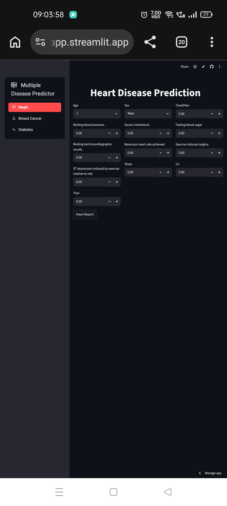

# Diseases-Prediction-WebApp

Developed a scalable Machine Learning and Deep Learning web application for predicting
Multiple diseases through an intuitive UI and API-driven architecture.

👉 Live App: https://diseases-prediction-webapp.streamlit.app/  
👉 API (Render): https://diseases-prediction-webapp-api.onrender.com  

Diseases For Prediction - Heart, Diabetes and Breast Cancer  
Models Used For Training - Logistic Regression and SVC

